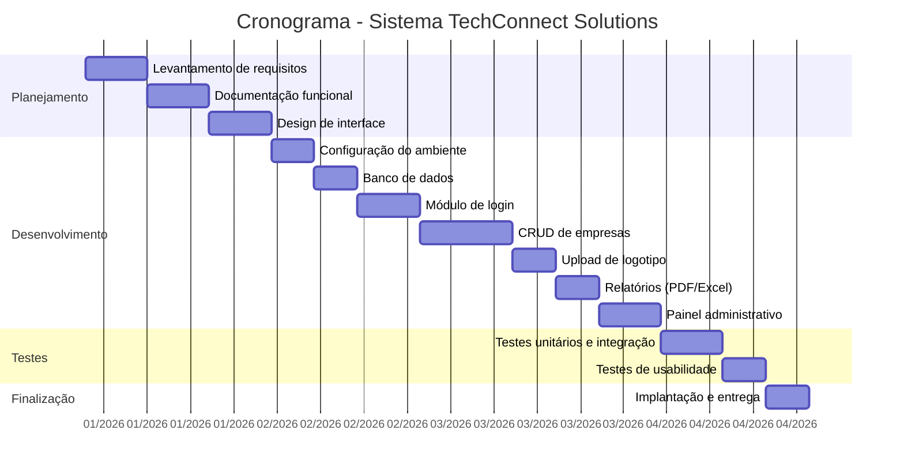

Perfeito — aqui está o **Exercício 2 completo**, já no formato **Mermaid simples (igual você pediu)** com:

* ✅ **Gráfico de Gantt (cronograma 6 meses)**
* ✅ **Matriz Crystal (entregas + pontos de atenção)**
* ✅ Pronto para colar no README do GitHub

---

# 📊 Gráfico de Gantt

---

# 🔷 Matriz Crystal (Entregas + Atenção)

```mermaid id="crystal_tc01"
graph TD
subgraph Matriz Crystal - TechConnect

%% Fluxo vertical principal
E1["Entrega 1"]:::baixo --> 
E2["Login funcionando<br>Autenticação + recuperação de senha"]:::medio --> 

E3["Entrega 2"]:::medio --> 
E4["CRUD de empresas"]:::alto --> 

E5["Entrega 3"]:::alto --> 
E6["Upload de logotipo"]:::alto --> 

E7["Entrega 4"]:::medio --> 
E8["Relatórios PDF e Excel"]:::alto --> 

E9["Entrega 5"]:::alto --> 
E10["Painel administrativo"]:::critico --> 

E11["Entrega Final"]:::critico --> 
E12["Sistema completo<br>Testado e implantado"]:::critico

end

%% Cores por intensidade
classDef baixo fill:#E0E0E0,color:#000,stroke:#9E9E9E,stroke-width:2px;
classDef medio fill:#FFD54F,color:#000,stroke:#F57F17,stroke-width:2px;
classDef alto fill:#FFA726,color:#fff,stroke:#EF6C00,stroke-width:2px;
classDef critico fill:#EF5350,color:#fff,stroke:#B71C1C,stroke-width:2px;

```

